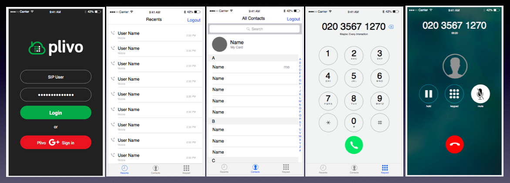
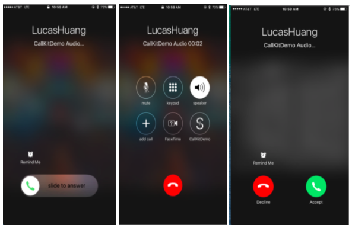

# Plivo Voice Quickstart for iOS

To get started with the quickstart application follow these steps. Steps 1-3 will enable the application to make a call. The remaining steps 4-6 will enable the application to receive incoming calls in the form of push notifications using Apple’s VoIP Service.

1. [Install the PlivoVoiceKit framework using Cocoapods](#bullet1)

2. [Create Endpoints](#bullet2)

3. [Run the app](#bullet3)

4. [Plivo iOS SDK V2 with Push Kit integration](#bullet5)

5. [Receive an incoming call](#bullet6)

### 1. Install the PlivoVoiceKit framework using Cocoapods

It's easy to install the Voice framework if you manage your dependencies using Cocoapods. Simply add the following to your Podfile:

    source 'https://github.com/cocoapods/specs'

    source 'https://github.com/plivo/cocoapod-specs'

    target 'TARGET_NAME' do
    use_frameworks!

    pod 'PlivoVoiceKit'
    end

### 2. Create Endpoints

Signup and create endpoints with Plivo using below link

[Plivo Dashboard](https://manage.plivo.com/accounts/login/)

### 3. Run the app

Open `ObjCVoiceCallingApp.xcworkspace` or `SwiftVoiceCallingApp.xcworkspace`. 

Build and run the app. 

Enter sip endpoint username and password. 

After successful login make VoiceCalls. 

### 4. Plivo iOS SDK V2 with Push Kit integration

To enable Pushkit Integration in the SDK, please refer to below link on Generating VoIP Certificate. 
[Generating VoIP Certificate](https://docs.google.com/a/plivo.com/document/d/15v23XNIQviE3j6F_Ik457DMXnQE7H712tHzEYOgixdA/edit?usp=sharing)

### 5. Receive an incoming call

    - (void)registerToken:(NSData*)token;

      This will enable the application to receive incoming calls even the app is not in foreground.

    - (void)relayVoipPushNotification:(NSDictionary *)pushInfo;

      PushInfo is the NSDictionary object forwarded by the apple push notification.

You are now ready to receive incoming calls. 

License

MIT
