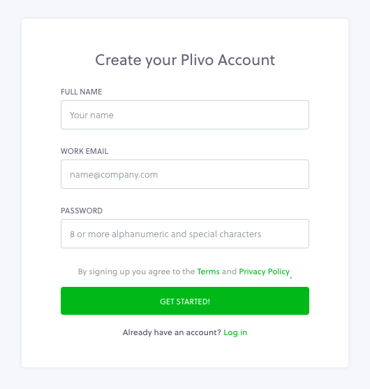
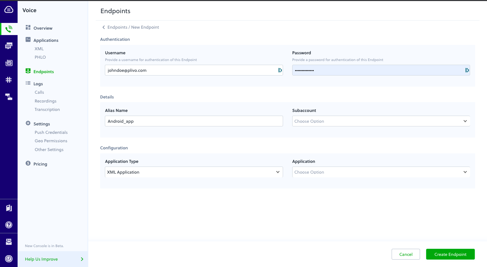

# Plivo Voice Quickstart for iOS


The Plivo iOS SDK v3 allows you to make outgoing and receive incoming calls in your iOS application.

Supports Pushkit and Callkit. Eliminates the need for persistent connections to recieve incoming calls.

Compatible with iOS version 12 and above.

Plivo iOS SDK supports IPv4 networks only. Users can make and receive calls when their device is connected to a network that uses IPv4 version of the protocol.

Handles network change internally.

To get started with the quickstart application follow these steps. Steps 1-3 will enable the application to make a call. The remaining steps 4-5 will enable the application to receive incoming calls in the form of push notifications using Apple’s VoIP Service.

1. [Install the PlivoVoiceKit framework using Cocoapods](#bullet1)

2. [Create Endpoints](#bullet2)

3. [Register and Unregister Endpoint](#bullet3)

4. [Run the app](#bullet4)

5. [Plivo iOS SDK V3 with Push Kit integration](#bullet5)

6. [Making an outgoing call](#bullet6)

7. [Receive an incoming call](#bullet7)


### <a name="bullet1"></a>1. Install the PlivoVoiceKit framework using Cocoapods

It's easy to install the Voice framework if you manage your dependencies using Cocoapods. Simply add the following to your Podfile:


pod 'PlivoWebRTC', '1.1.6-beta'

pod 'PlivoVoiceKit', '3.1.1-beta'


[SDK Reference](https://www.plivo.com/docs/sdk/client/ios/reference-v3/) - More documentation related to the Voice iOS SDK

### Sign up for an account
Register [here](https://console.plivo.com/accounts/register/) to get your free Plivo account today.

Below are the steps that are to be followed to successfully Sign up for a free trial account.
1. Sign up with your corporate email address
2. You will receive an activation email from Plivo. Click on the link mentioned in the email to activate your account.
3. Enter an sms enabled, non-VOIP number to complete the phone verification.

Sign up with your corporate email address



If you are facing any issues while creating a Plivo account, you can reach out to our [Support Team](https://support.plivo.com/support/home)

### <a name="bullet2"></a>2. Create Endpoints

You can create an endpoint from the Plivo Console and assign an application to make and receive calls after configuring the endpoint in the quickstart app.


**Note:** You can make use of the demo 'Direct Dial' app in your account for the endpoint which will allow you to make and receive calls for testing purposes.

### <a name="bullet3"></a>3. Rgister and Unregister Endpoints


- Register with Plivo's SIP and Media server , use a valid sip uri account from plivo web console 
```
var endpoint: PlivoEndpoint = PlivoEndpoint(debug: true)
```

- Implement SIP register to Plivo Communication Server using username and password

```
// To register with SIP Server using username and password
endpoint.login(userName, andPassword: password)

// To register with SIP Server using username, password and deviceToken
endpoint.login(userName, andPassword: password, deviceToken: token)

// To register with SIP Server using username, password, deviceToken and certificate ID
endpoint.login(userName, andPassword: password, deviceToken: token, certificateId: certId)
```
- Implement SIP register to Plivo Communication Server using AccessToken

```
// To register with SIP Server using AccessToken
endpoint.loginWithAccessToken(accessToken)

// To register with SIP Server using AccessToken and deviceToken
endpoint.loginWithAccessToken(accessToken, deviceToken: token)

// To register with SIP Server using AccessToken, deviceToken and certificateId
endpoint.loginWithAccessToken(accessToken, deviceToken: token, certificateId: certiId)

// To register with SIP Server using AccessTokenGenerator
// implement the JWTDelegate's getAccessToken() method to fetch
// the token at real time and call the loginWithAccessToken() method
// once the token is fetched.
endpoint.loginWithAccessTokenGenerator(jwtDelegate: self)
```

- Unregister and logout from the  SIP Server
```
endpoint.logout()
```

If the registration to an endpoint is succeessfull the following delegate gets called 
```
onLogin(): Void
```


If the registration to an endpoint fails the following delegate gets called 
```
onLoginFailedWithError(_ error: Error): Void
```

Possible error events when login with Access Token:
- INVALID_ACCESS_TOKEN
- INVALID_ACCESS_TOKEN_HEADER
- INVALID_ACCESS_TOKEN_ISSUER
- INVALID_ACCESS_TOKEN_SUBJECT
- ACCESS_TOKEN_NOT_VALID_YET
- ACCESS_TOKEN_EXPIRED
- INVALID_ACCESS_TOKEN_SIGNATURE
- INVALID_ACCESS_TOKEN_GRANTS
- EXPIRATION_EXCEEDS_MAX_ALLOWED_TIME
- MAX_ALLOWED_LOGIN_REACHED


When the user logs in with AcessToken and does not have the permission to make outgoing/receive incoming calls.
```
void onPermissionDenied(_ error: Error)
```

### <a name="bullet4"></a>4. Run the app

 PlivoVoiceKit Framework and its required dependencies are already added in the Podfile. Run ```pod install``` to install those dependencies.

Open `SwiftVoiceCallingApp.xcworkspace`.

Build and run the app. 

Enter sip endpoint username and password OR AccessToken in constant.h file. 

After successful login make VoiceCalls. 


### <a name="bullet5"></a>5. Plivo iOS SDK V3 with Push Kit integration

To enable Pushkit Integration in the SDK the ```loginForIncomingWithUsername```  and ```loginForIncomingWithJWT``` are implemented 
```

//receive and pass on the notification payload when logging with username and password

endpoint.loginForIncomingWithUsername(withUserName: username, withPassword: password, withDeviceToken: deviceToken, withNotificationInfo: payload.dictionaryPayload)


//receive and pass on the notification payload when logging with AccessToken
endpoint.loginForIncomingWithToken(withAccessToken: accessToken, withDeviceToken: deviceToken, withNotificationInfo: payload.dictionaryPayload)

```
Note: ```relayVoipPushNotification``` method has been deprecated.

please refer to below link on Generating VoIP Certificate. 

[Generating VoIP Certificate](https://www.plivo.com/docs/sdk/client/ios/setting-up-push-credentials/)


### <a name="bullet6"></a>6. Making an outgoing call

Create PlivoOutgoingCall object , then make a call with destination and headers 
```
func call(withDest dest: String, andHeaders headers: [AnyHashable: Any], error: inout NSError?) -> PlivoOutgoing {

    // construct SIP URI , where kENDPOINTURL is a contant contaning
    //domain name details
    let sipUri: String = "sip:\(dest)\(kENDPOINTURL)"

    /* create PlivoOutgoing object */
    outCall = (endpoint.createOutgoingCall())!

    /* do the call */
    outCall?.call(sipUri, headers: headers, error: &error)

    return outCall!
}

//To Configure Audio
endpoint.configureAudioDevice()

//To start Audio
endpoint.startAudioDevice()

//To stop Audio
endpoint.stopAudioDevice()
```
configureAudioSession - use this callkit method to set up the AVAudioSession with desired configuration.

startAudioDevice - use this callkit method to start the AVAudioSession with desired configuration.

stopAudioDevice - use this callkit method to stop the AVAudioSession with desired configuration.

Make an outbound call

Calling this method on the PlivoOutgoing object with the SIP URI
would initiate an outbound call.
```
(void)call:(NSString *)sipURI error:(NSError **)error;
```

Make an outbound call with custom SIP headers

Calling this method on the PlivoOutgoing object with the SIP URI
would initiate an outbound call with custom SIP headers.
```
(void)call:(NSString *)sipURI headers:(NSDictionary *)headers error:(NSError **)error;
```


### <a name="bullet7"></a>7. Receive an incoming call

```
// MARK: PKPushRegistryDelegate
func pushRegistry(_ registry: PKPushRegistry, didUpdate credentials: PKPushCredentials, forType type: PKPushType) {

    if credentials.token.count == 0 {
        print("VOIP token NULL")
        return
    }

}

//When the push arrives below delegate method will be called. 
func pushRegistry(_ registry: PKPushRegistry, didReceiveIncomingPushWith payload: PKPushPayload, forType type: PKPushType) {

    if (type == PKPushType.voIP) {

        DispatchQueue.main.async(execute: {() -> Void in
            endpoint.loginForIncomingWithUsername(withUserName: username, withPassword: password, withDeviceToken: deviceToken, withNotificationInfo: payload.dictionaryPayload)
        })
    }
}
```
PushInfo is the NSDictionary object forwarded by the apple push notification. This will enable the application to receive incoming calls even the app is not in foreground.


You are now ready to receive incoming calls. 


License

MIT
